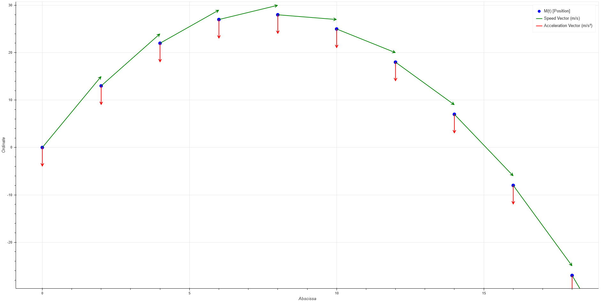

# Chronograph
Python Program for Physical Movement's Study (Education)

* With Graphical Output readable on all Internet Navigators (with the Bokeh Module*)
* Automatic Chart Stretching
* Show the Speed, and the Acceleration Vectors for each Point of the Movement
* Recognition of the equations of the movement (Python Format) and Derivation Automatic

---

### Example :

`M(t) = M(x(t); y(t))` with `x(t) = 2t` and `y(t) = -2t² + 15t`

----

*This Module may have to be downloaded
