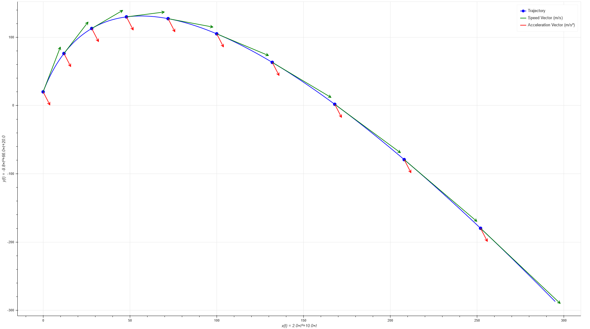
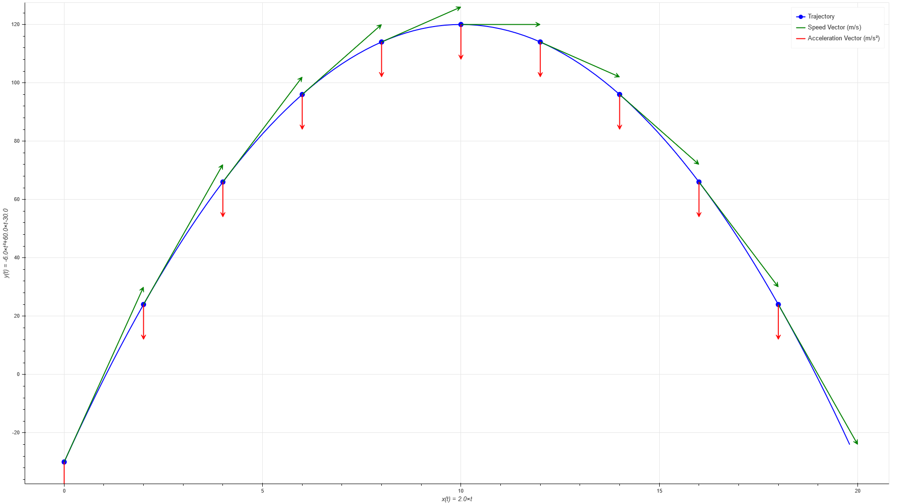

# Chronograph
Python Program for Physical Movement's Study (Education)

* With Graphical Output readable on all Internet Navigators (with the Bokeh Module*)
* Automatic Chart Stretching
* Show the Formulas on the Axes
* Show the Speed, and the Acceleration Vectors for each Point of the Movement
* Recognition of the equations of the movement (Python Format) and Derivation Automatic

---

### Screenshots :

----

*This Module may have to be downloaded
